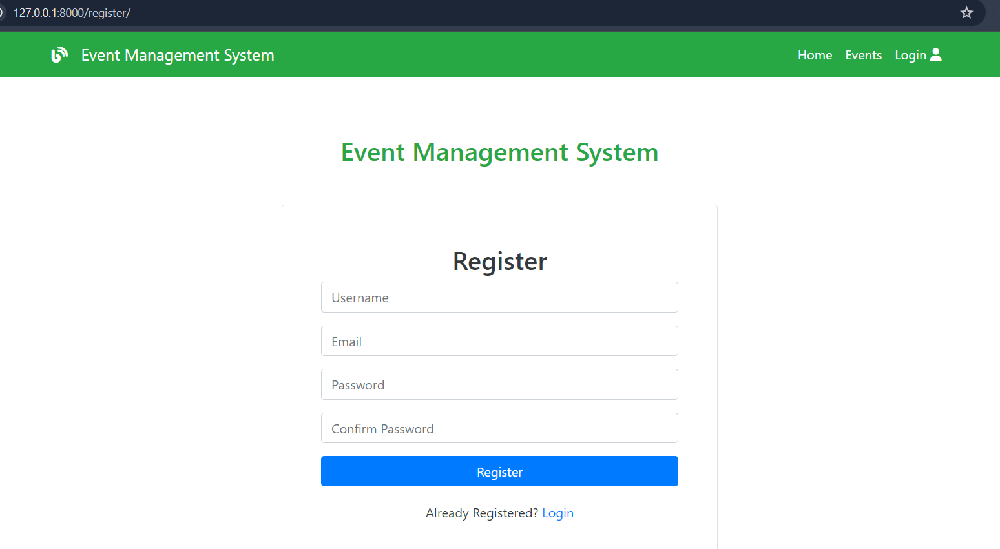
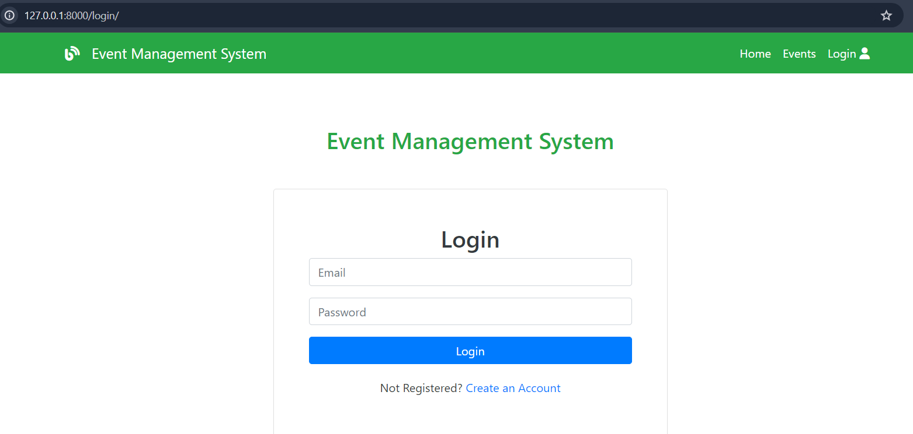
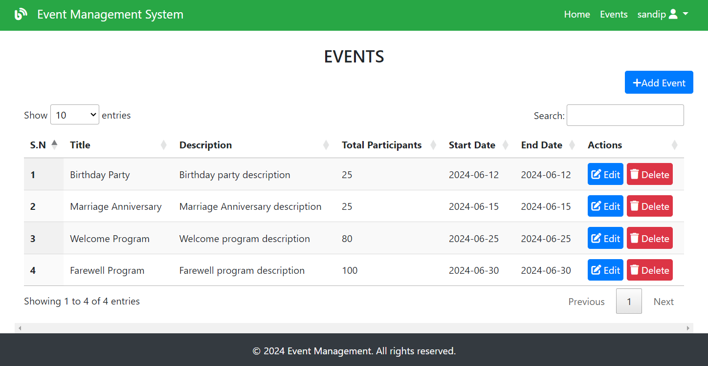
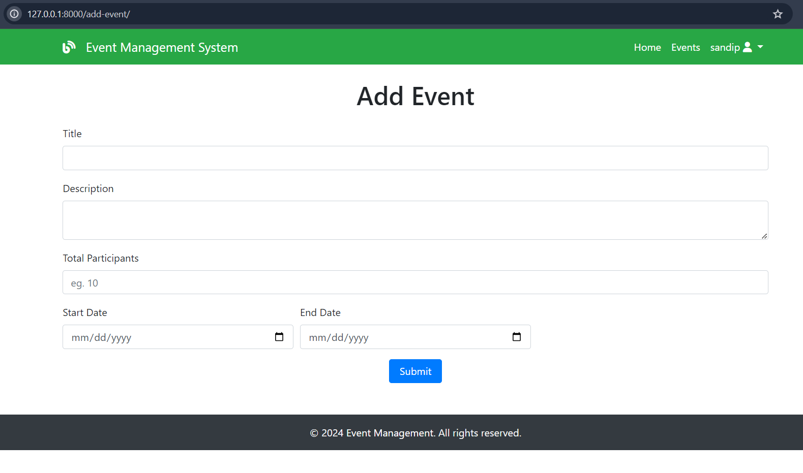
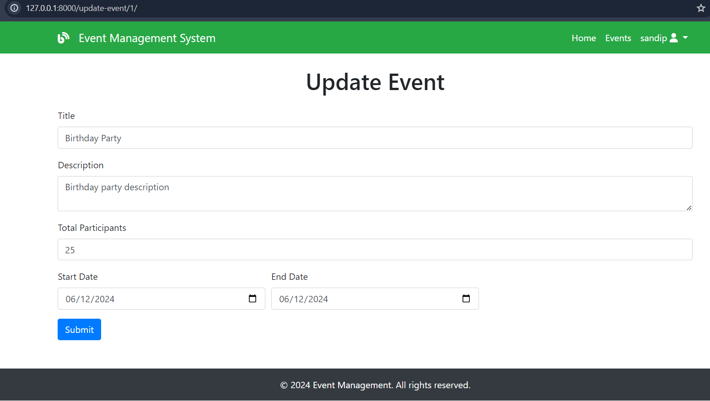

# Welcome to Event Management System
# let's get started with setup instructions

1. First you need to have 'Python' installed on your system and path should be added.

2. Clone the project.
3. Open terminal and input a command : 
    👉 pip install django
4. After django is installed, simply enter command :  
    👉 python manage.py runserver
5. The project will run on localhost or '127.0.0.1:8000'. simply open on browser.

6. you will be displayed a homepage. You have to login to view events. First you have to register.

7. After you register/login then you will be able to see events page and perform curd operations.

Screenshots:-
Register Page:

Login Page:

Events page

Add Events page:

Update Event Page:
